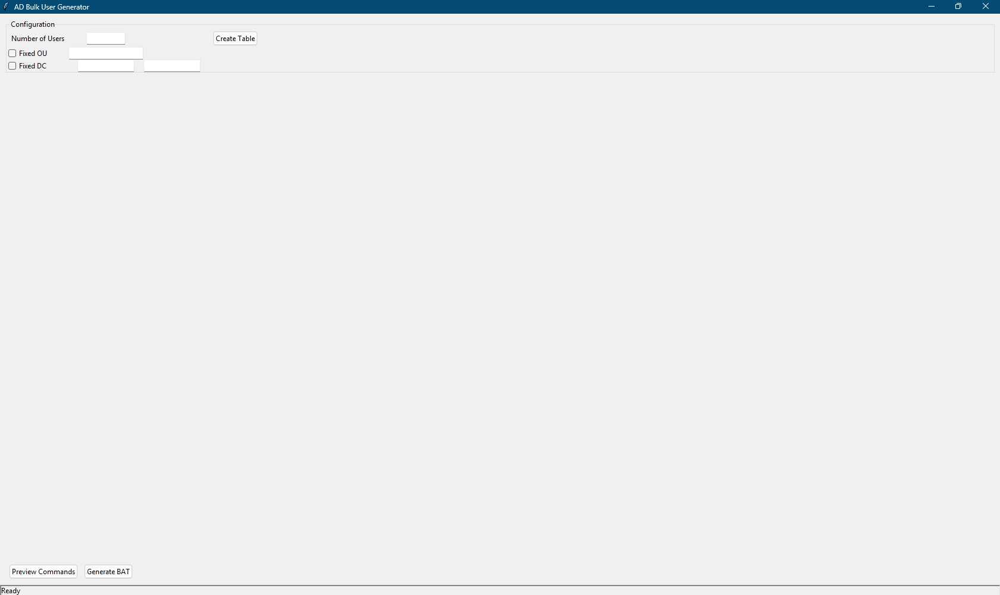
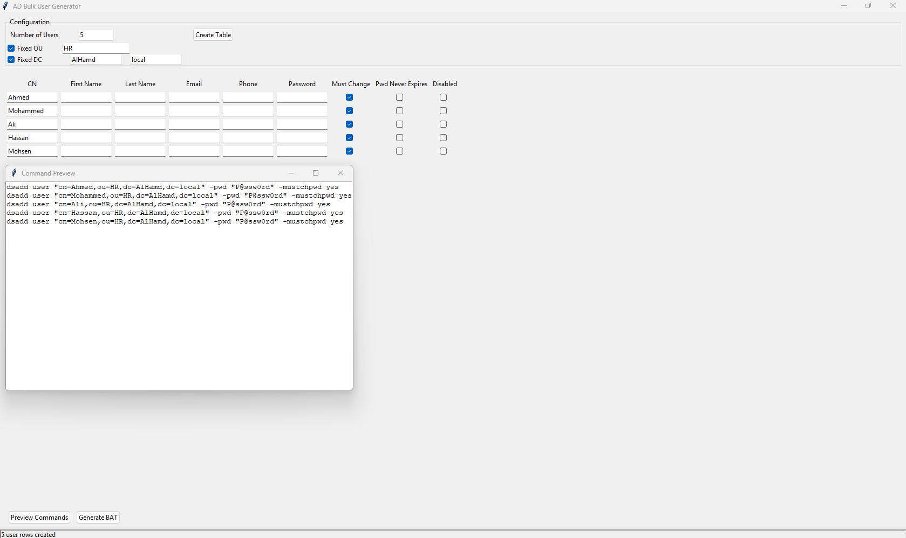

# Active Directory Bulk User Generator

A Python Tkinter-based GUI application for generating bulk Active Directory user creation commands using `dsadd user`.

The tool simplifies the process of creating multiple AD users by generating a ready-to-run `.bat` file with customizable user attributes and account settings.

---

## Screenshots

### Main Window



### Command Preview



---

## Features

### User Configuration

* Create multiple users at once
* Dynamic user table generation
* Generate bulk `dsadd user` commands

### Organizational Structure

* Fixed OU for all users
* Per-user OU configuration
* Fixed Domain Components (DC)
* Per-user DC configuration

### User Attributes

* Common Name (CN)
* First Name
* Last Name
* Email Address
* Telephone Number
* Password

### Account Options

* Must Change Password at Next Logon
* Password Never Exires
* Account Disabled

### Export & Preview

* Preview generated commands before export
* Save commands as a `.bat` file
* Status bar notifications

---

## Technologies Used

* Python 3
* Tkinter

No third-party GUI libraries are required.

---

## Installation

Clone the repository:

```bash
git clone https://github.com/YHS003/ad-bulk-user-generator.git
cd ad-bulk-user-generator
```

Run the application:

```bash
python main.py
```

---

## Building an EXE File

Install PyInstaller:

```bash
pip install pyinstaller
```

Build the executable:

```bash
pyinstaller --onefile --windowed main.py
```

The generated executable will be located in:

```text
dist/main.exe
```

---

## Usage

### Step 1

Enter the number of users.

### Step 2

Choose whether:

* OU is fixed for all users
* DC values are fixed for all users

### Step 3

Generate the user table.

### Step 4

Fill in user information and account settings.

### Step 5

Preview generated commands.

### Step 6

Generate and save the BAT file.

### Step 7

Run the BAT file on a Windows Server machine with Active Directory tools installed.

---

## Example Output

```bat
dsadd user "cn=Ahmed,ou=Employees,dc=company,dc=local" -fn "Ahmed" -ln "Ali" -email "ahmed@company.local" -tel "01012345678" -pwd "P@ssw0rd" -mustchpwd yes

dsadd user "cn=Sara,ou=Employees,dc=company,dc=local" -fn "Sara" -ln "Mohamed" -pwd "P@ssw0rd" -pwdneverexpires yes
```

---

## Project Structure

```text
ad-bulk-user-generator/
│
├── main.py
├── README.md
├── LICENSE
│
└── screenshots/
    ├── main-window.png
    └── preview-window.png
```

---

## Future Improvements

* CSV Import
* Excel Import/Export
* PowerShell Export
* User Templates
* Dark Mode
* Direct Active Directory Integration

---

## Author

**Yehya Hamdy Shehata (SCRonin)**

* Computer & Control Engineer
* Cybersecurity Enthusiast

GitHub:
https://github.com/YHS003

Repository:
https://github.com/YHS003/ad-bulk-user-generator

---

## License

This project is licensed under the MIT License.
